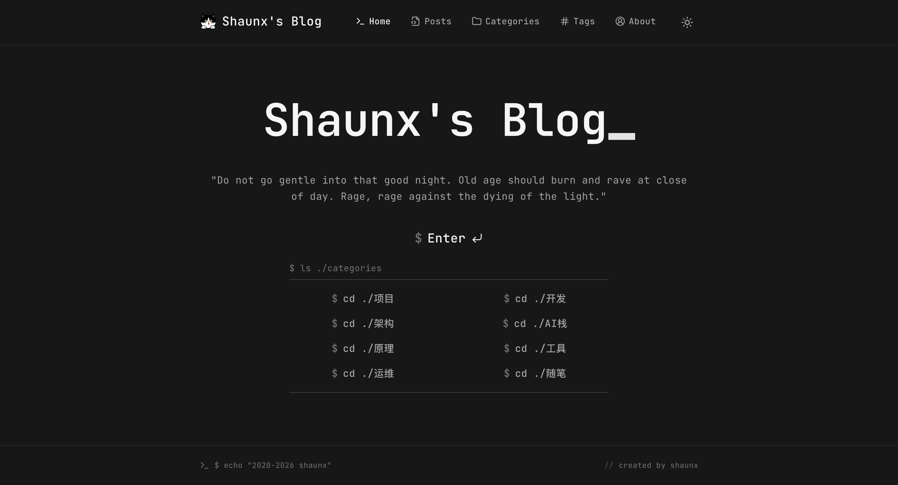
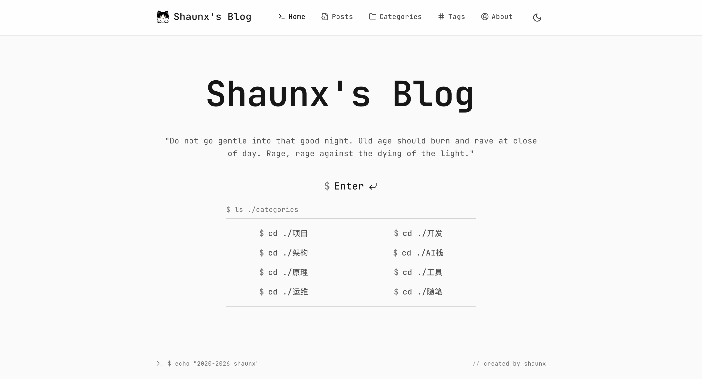
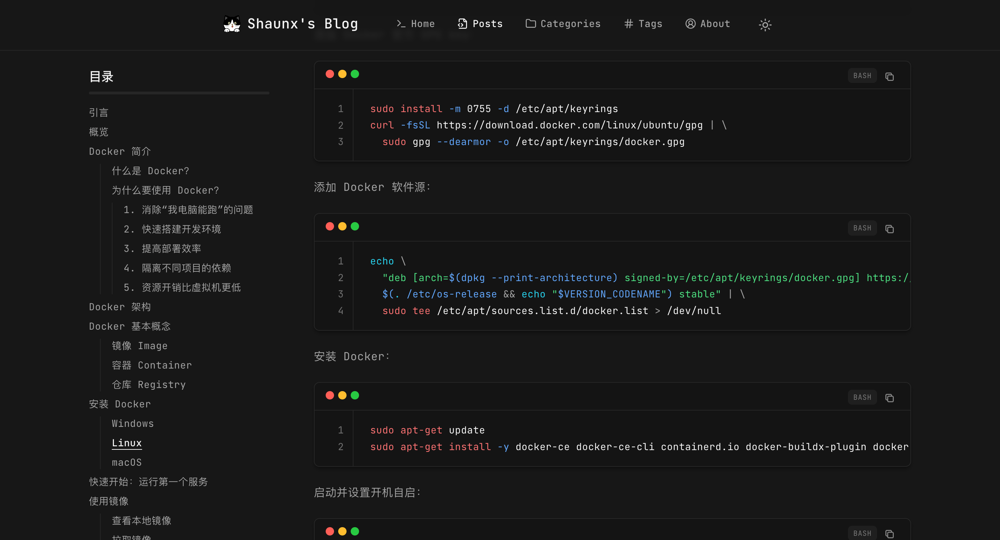
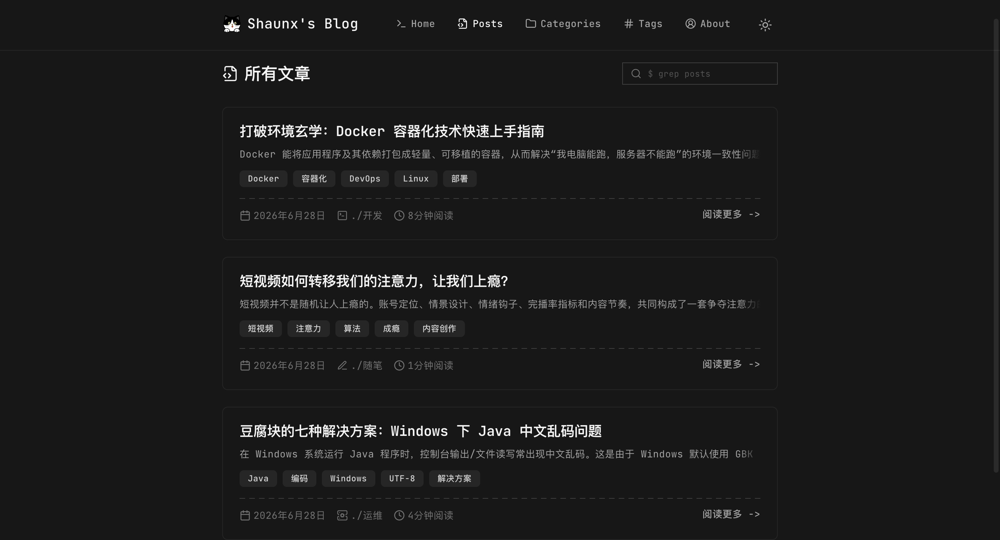

# Shaunx Blog

Shaunx Blog 是一个基于 Next.js 14 App Router 的个人博客系统。它用 Markdown 管理文章和页面内容，提供极简的黑白灰界面、分类标签、RSS、后台编辑、图片管理和 Docker 部署能力。

项目更偏向个人技术博客的长期维护场景：内容保存在仓库或挂载目录中，配置可以热加载，页面尽量保持安静、克制、可读。

## 预览

### 深色首页



### 浅色首页



### 文章详情



### 文章列表



## 功能

- Next.js 14 App Router + TypeScript
- Markdown 文章和页面内容管理
- 文章分类、标签、搜索和分页
- 深色/浅色主题切换
- RSS、Atom 和 JSON Feed
- 文章目录、代码高亮、GFM 表格、链接预览卡片
- 站点配置动态加载
- JWT 保护的管理后台
- 在线 Markdown 编辑器和图片管理
- Docker 部署和内容同步脚本

## 技术栈

- Next.js 14
- React 18
- TypeScript
- Tailwind CSS
- gray-matter
- remark / rehype
- lucide-react
- feed

## 快速开始

环境要求：

- Node.js 18+
- pnpm 9+

安装依赖并启动开发服务器：

```bash
pnpm install
pnpm dev
```

访问：

```text
http://localhost:3000
```

常用命令：

```bash
pnpm dev
pnpm build
pnpm start
pnpm lint
pnpm type-check
```

## 内容目录

```text
content/
├── posts/    # Markdown 文章
├── pages/    # 独立页面
└── images/   # 内容图片
```

文章文件放在 `content/posts/`，页面文件放在 `content/pages/`。图片建议放在 `content/images/`，应用会通过 `/api/images/...` 提供访问。

文章 frontmatter 示例：

```markdown
---
title: "文章标题"
date: "2026-01-01"
category: 开发
tags: ["Next.js", "TypeScript"]
description: "文章摘要"
cover: "/images/cover.png"
published: true
---

# 正文标题

这里是文章内容。
```

## 站点配置

站点配置位于：

```text
config/site.config.json
```

常见字段：

```json
{
  "title": "Shaunx's Blog",
  "description": "站点描述",
  "introduction": "首页介绍",
  "author": {
    "name": "shaunx",
    "email": "name@example.com",
    "github": "github-username"
  },
  "url": "https://example.com",
  "postsPerPage": 6,
  "excerptLength": 200,
  "secureEntrance": "8位安全入口码"
}
```

## 管理后台

后台入口：

```text
/admin?key=YOUR_8_CHAR_CODE
```

后台能力：

- 文章创建、编辑和删除
- 页面内容管理
- 图片上传和删除
- 站点配置编辑
- JWT 会话校验
- PC 端访问限制

安全入口码来自 `config/site.config.json` 的 `secureEntrance` 字段。生产环境不要公开这个值。

## Docker 部署

使用项目内的 Docker Compose 配置：

```bash
docker compose -f docker/docker-compose.yml up -d
```

查看日志：

```bash
docker compose -f docker/docker-compose.yml logs -f
```

停止服务：

```bash
docker compose -f docker/docker-compose.yml down
```

也可以使用部署脚本：

```bash
scripts/deploy.sh
```

部署后的内容同步脚本：

```bash
scripts/deploy-content.sh
```

预览同步结果：

```bash
scripts/deploy-content.sh --dry-run
```

自动判断更新类型：

```bash
scripts/deploy-content.sh --mode auto --only-on-change
```

## 项目结构

```text
shaunx-blog/
├── config/              # 站点配置
├── content/             # 文章、页面和图片内容
├── docker/              # Docker 配置
├── docs/                # 预览图资源
├── public/              # 公共静态资源
├── scripts/             # 部署和内容同步脚本
├── src/
│   ├── app/             # Next.js App Router 页面和 API
│   ├── components/      # UI 和业务组件
│   ├── hooks/           # 客户端 hooks
│   ├── lib/             # 内容解析、配置、认证和工具函数
│   └── types/           # TypeScript 类型
├── package.json
├── pnpm-lock.yaml
└── tailwind.config.ts
```

## 原作者链接

[FT-Fetters/tiny-blog-open](https://github.com/FT-Fetters/tiny-blog-open)
